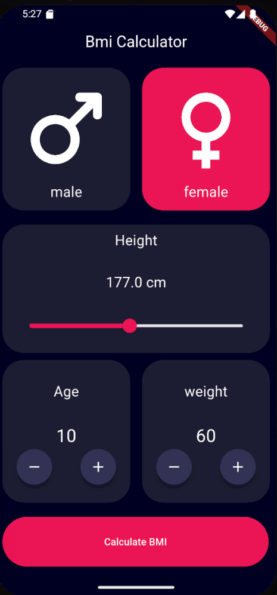
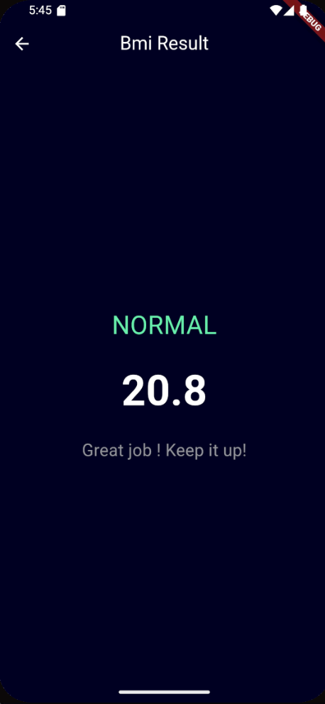

# bmi_calculator

A new Flutter project.# Flutter bmi calculator Detail Screen 


---

## 📱 Preview

<p align="center">
  
</p>

<p align="center">
  
</p>


---

## 🚀 Project Overview

This single-screen application focuses on a high-conversion UI/UX design, showcasing:


---

## 🛠️ Technologies Used

* **Framework:** [Flutter](https://flutter.dev)
* **Language:** [Dart](https://dart.dev)
* **Design System:** Material Design 3

---

## 📦 How to Run

1.  **Clone the repository:**
    ```bash
    git clone [https://github.com/YOUR_USERNAME/YOUR_REPO_NAME.git](https://github.com/YOUR_USERNAME/YOUR_REPO_NAME.git)
    ```
2.  **Navigate to the folder:**
    ```bash
    cd flutter_food_ui
    ```
3.  **Get dependencies:**
    ```bash
    flutter pub get
    ```
4.  **Run the app:**
    ```bash
    flutter run
    ```

---

## 🎨 Key Widgets Implemented
* `ClipPath` / `CustomClipper`: Used for the stylized header banner.
* `StatefulWidget`: Manages the quantity counter and cart logic.
* `ThemeData`: Custom color palettes for food-based branding (Oranges, Reds, and Creams).

---
Yahya Hesham

